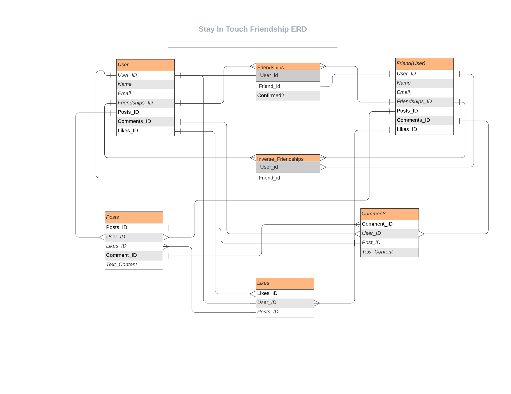

 Social media website

> Social Media application. You can sign up with and email and password and then create posts and add others as a friend.

## Built With

- Ruby v2.7.0

## Database Diagram

### Prerequisites

- Ruby 2.7.2
- Rails
- Postgres

### Setup
- Refer to the [Postgres Documentation](https://www.postgresql.org/docs/) on how to setup a local server
- Open your terminal/command/console and type in 'rails db:create'
- with the console still open, type in 'rails db:migrate'
- afterwards type 'rails s'
- Open your browser and in the address bar type 'http://localhost:3000/'
- You should be able to make an account, and make posts, like posts, and accept/reject friends

### Authors
## Janluc Saneaux
- 👤GitHub: [Janluc Saneaux](https://github.com/janluc)
- Twitter: [@janluc123](https://twitter.com/janluc123)
- Linkedin: [Janluc Saneaux](https://www.linkedin.com/in/janluc-saneaux-91707a1b4/)

### Author
## Deyan Todorov
- 👤GitHub: [deikdesign](https://github.com/deikdesign/)
- Twitter: [@deikdesign](https://twitter.com/deikdesign)

## 🤝 Contributing

Contributions, issues and feature requests are welcome!
Feel free to check the issues page.

## Show your support

Give a ⭐️ if you like this project!

## Acknowledgments

- [Microverse](https://www.microverse.org/).

## 📝 License

This project is [MIT licensed](LICENSE).

